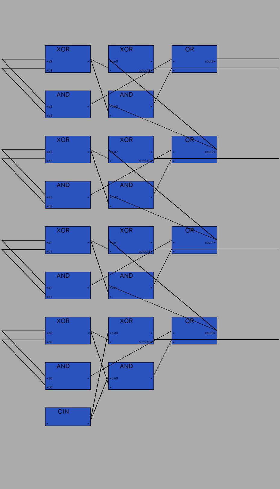

# Overview
Note: This project is a work in progress. Wire connections are implemented lazily, and the documentation may not be complete.

## Blocks

Blocks are defined using curly braces `{ }`, and have inputs and outputs.
Each input and output is seperated by a `,` and the set of inputs and outputs is
seperated by `->`.

For example

`{a, b, c -> d, e}`

is a block with 3 inputs and 2 outputs.

### Naming

To add a display name to a block, preface the inputs with `NAME:` For example:

`{CoolBlock: a, b, c -> d, e}`

Currently, the inputs a, b, c; and the outputs d, e are labels for ports.
This means they do not render, but rather are used to tell the program where to link ports to.
All output labels get sent to any matching input label.

To name a port so it displays, use a `.` after the input/output. For example:

`{CoolBlock: a.nameOfA, b.nameOfb, c.nameOfc -> d.nameOfd, e.nameOfd}`


### Output lines

By default, all unlinked output ports are turned into output lines.
To disable this place an `_` anywhere in the port label. For example:

`{a, b -> c_.nameOfC}`

To force an output line from a linked output port, place a `^` on the port label. For example:

`{NOR:S.Set, Q2 -> Q1^.output1}{NOR: Q1, R.Reset -> Q2^.output2}`


### Block Height

Blocks have two heights; an internal height (or a draw height) and a display height.
The internal height is the vertical height of the block, and is calculated as
`1 + max(numberOfInputs, numberOfOutputs)`.
This is the height of the block drawn.
The display height is the `internalHeight + 2` by default, but can be set to any value greater than that manually.
To set this, end the block with `#height`. For example:

`{a, b -> c, d#10}`

Would create a block with internal height 3 (`1 + max(2,2)`) and a display height of 10.
If the display height specified is less than `internalHeight + 2`, then it is set to `internalHeight + 2` regardless.
Changing the display height is useful to align gates between columns for spacing issues.

## Iterators

To create blocks iteratively, use the following notation around any set of blocks:

`$(start, end)[{Block1}{Block2}...{Blockn}]`

Start and end can be any two postive integers and the range is inclusive.
If start is greater than end, iterator is done in reverse order.
To use the numbers in the range of the iterator is the `&` symbol to reference the number.
For example:

`$(0,3)[{CoolBlock&: a&.nameOfA&, b&.nameOfB&->c&.nameOfC&}]`

would expand to

`{CoolBlock0: a0.nameOfA0, b0.nameOfB0->c0.nameOfC0}{CoolBlock1: a1.nameOfA1, b1.nameOfB1->c1.nameOfC1}{CoolBlock2: a2.nameOfA2, b2.nameOfB2->c2.nameOfC2}{CoolBlock3: a3.nameOfA3, b3.nameOfB3->c3.nameOfC3}`

Iterators can also do basic math using +, - and *. The order of operations is left to right. Math must be placed in parentheses `()`. For example:

`$(2,0)[{a->b(& + 1)(& + 1 * &), c(3 - &)}]`

would expand to

`{a->b36, c1}{a->b23, c2}{a->b10, c3}`


# Examples

Note: Wires are currently simply drawn as straight lines.

4-bit Full Adder:

```
$(3,0)[{XOR: a&.a&, b&.b& -> fg&}{AND: a&.a&, b&.b& -> fcout&}]{CIN:NA_->cin0};
$(3,0)[{XOR: cin&.cin&, fg& ->_,sg&^.output&}{AND: cin&.cin&, fg& -> scout&}];
$(3,0)[{OR: fcout&, scout& -> cin(&+1).cout&#10}]
```



